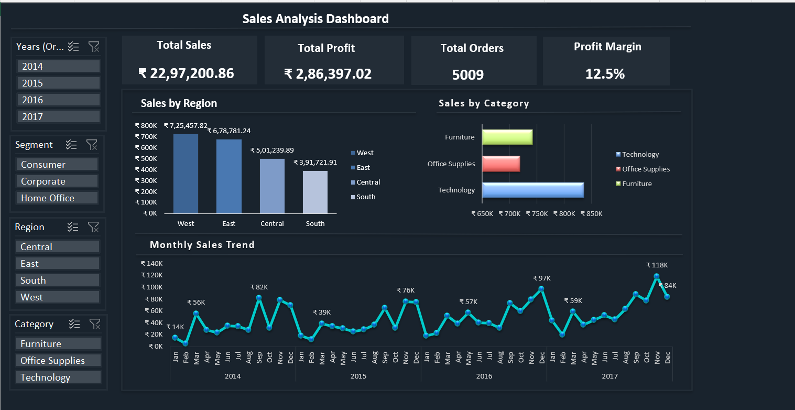

# 📊 Sales Analysis Dashboard – Sample Superstore

### 🧩 Project Overview
This Excel‑based dashboard analyzes sales performance using the **Sample Superstore** dataset. It provides insights into revenue, profit, orders, and profit margin across regions, categories, and time periods.  
The project demonstrates **data cleaning, transformation, and visualization** skills using Microsoft Excel.

---

### 📂 Source and Data Fields
- **Source:** Kaggle – Sample Superstore dataset  
- **Data Fields:**
  - `Row ID`, `Order ID`, `Order Date`, `Ship Date`, `Ship Mode`  
  - `Customer ID`, `Customer Name`, `Segment`, `Country`, `City`, `State`, `Postal Code`, `Region`  
  - `Product ID`, `Category`, `Sub‑Category`, `Product Name`  
  - `Sales`, `Quantity`, `Discount`, `Profit`, `Profit Margin`  
  - `status` (Profit/Loss indicator)  
  - `Unique orderids` (used for order count aggregation)

---

### ⚙️ Tools & Techniques
- Microsoft Excel (PivotTables, PivotCharts, Slicers, KPI Cards)  
- Power Query for data cleaning and transformation  
- Custom number formatting for currency and K‑notation  
- Interactive dashboard design with slicers and dynamic charts  

---

## 📸 Dashboard Preview

---
### 📈 Insights & Findings
- **Total Sales:** ₹ 22,97,200.86  
- **Total Profit:** ₹ 2,86,397.02  
- **Total Orders:** 5009  
- **Profit Margin:** 12.5 %  
- **Top Region:** West  
- **Leading Category:** Technology  
- Seasonal trends show consistent growth in Q4 across all years.

---

### 🚀 Actionable Recommendations
- Focus marketing efforts on **Technology** products in the **West** region.  
- Optimize pricing and discount strategies for **Furniture**, which shows lower margins.  
- Expand corporate segment sales in **Central** and **South** regions to balance performance.  
- Introduce quarterly reviews using this dashboard to track KPIs dynamically.

---

### 💡 Challenges & Learnings
- Handling inconsistent date formats during data cleaning.  
- Designing dynamic KPI cards linked to PivotTables.  
- Applying custom number formats for “K” and “M” notation.  
- Learned how to structure Excel dashboards for professional portfolio presentation.
